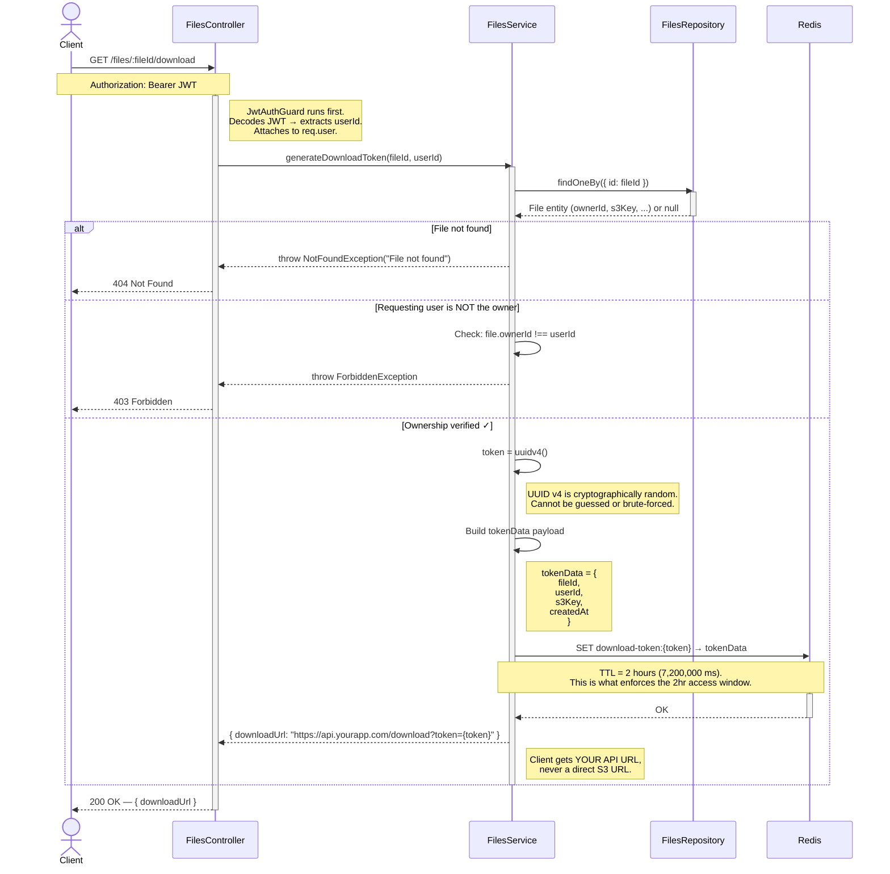
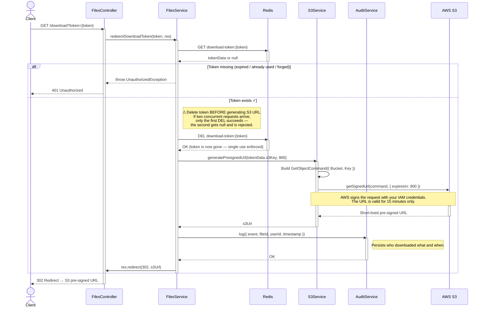
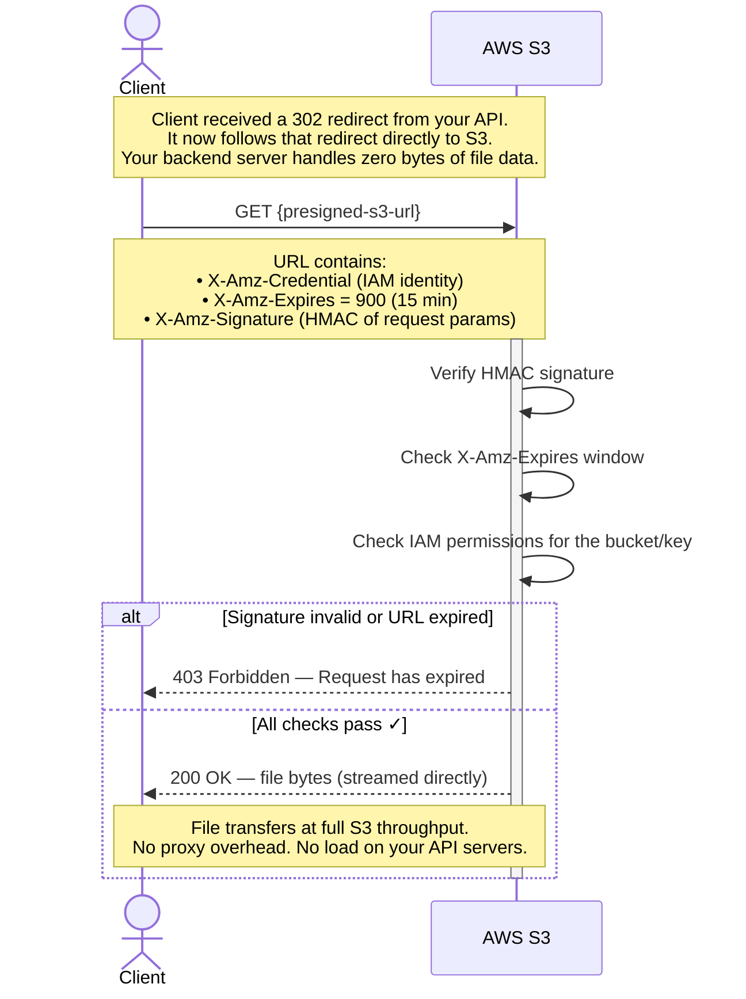

# Pre-Signed URL System — Sequence Diagrams

---

## Diagram 1 — Generate Download Token

> Client requests a file download. The backend verifies ownership and returns a short-lived proxy token — never an S3 URL.

---

## Diagram 2 — Redeem Token & Get S3 URL

> Client hits the redemption endpoint. The backend validates the token, deletes it (single-use), generates a short-lived S3 URL, then redirects.

---

## Diagram 3 — Direct S3 Download

> The browser follows the 302 redirect and downloads directly from S3. Your server is completely out of the data path.

---

## Security Properties Summary

| Property | Enforced by |
|---|---|
| Valid only 2 hours | Redis TTL on the download token (Diagram 1) |
| Tied to a specific user | `userId` in token payload, checked against JWT on redemption (Diagram 2) |
| Non-transferable | Another user's JWT produces a different `userId` — token rejects it |
| Revocable | `DEL download-token:{token}` in Redis kills access immediately |
| Single-use | Token deleted from Redis **before** S3 URL is generated (Diagram 2) |
| Race condition safe | First `DEL` wins; concurrent second request gets null → 401 |
| Audit trail | Every redemption logged with `userId`, `fileId`, `timestamp` (Diagram 2) |
| Server not in data path | Client streams bytes directly from S3 via redirect (Diagram 3) |
